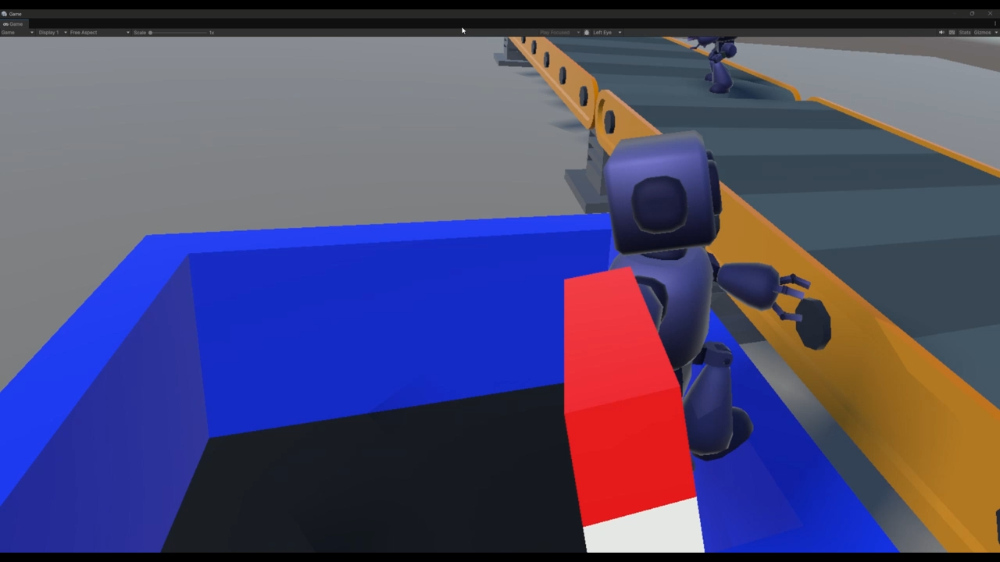
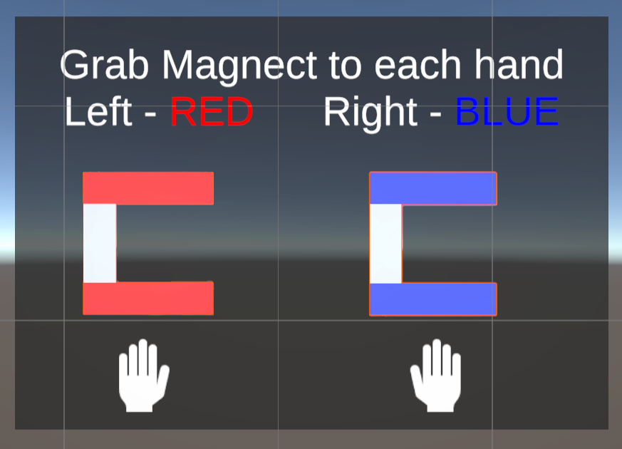
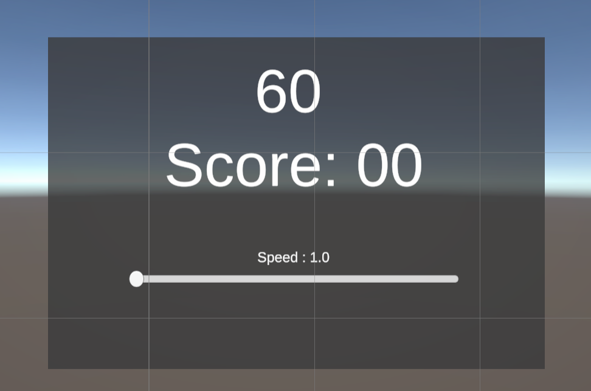
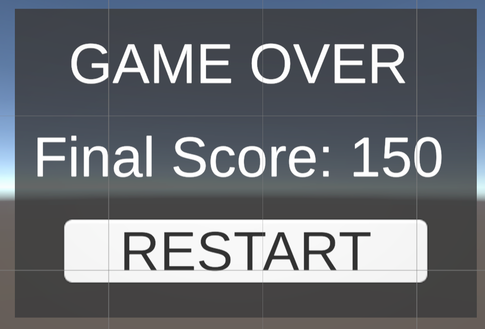

# Magnetic Robots Factoty



Meta Quest용 VR 로봇 분류 게임입니다. 공장의 컨베이어 벨트에서 이동하는 빨간색·파란색 로봇을 **반대 색상의 자석**으로 끌어당긴 뒤, 로봇과 같은 색의 파이프에 넣어 점수를 얻습니다.

> 프로젝트명은 요청받은 표기인 `Magnetic Robots Factoty`를 사용했습니다.

## 프로젝트 개요

| 항목 | 내용 |
| --- | --- |
| 장르 | VR 아케이드 / 공장 작업 시뮬레이션 |
| 개발 엔진 | Unity 6 (`6000.2.8f1`) |
| 대상 환경 | Meta Quest 계열, OpenXR |
| 렌더링 | Universal Render Pipeline (URP) |
| 플레이 목표 | 제한 시간 동안 로봇을 올바른 파이프로 분류해 높은 점수 획득 |
| 시작 씬 | `Assets/Scenes/Tutorial.unity` |
| 메인 씬 | `Assets/Scenes/Main.unity` |

## 핵심 기능

- 빨간색과 파란색 로봇을 무작위로 생성
- 물리 충돌을 이용한 컨베이어 이동
- 슬라이더로 컨베이어 속도를 `1.0`부터 `8.0`까지 조절
- Meta XR Grab Interaction으로 왼손·오른손 자석 장착
- Ray Grab과 Move Towards Target 방식의 원거리 로봇 조작
- 로봇과 파이프의 색을 비교해 점수 반영
- 제한 시간, 현재 점수, 컨베이어 속도 UI
- 게임 종료 후 최종 점수 표시 및 현재 씬 재시작
- Ray Interaction을 이용한 Start, Restart 버튼 및 슬라이더 조작

## 게임 설명

게임을 시작하면 빨간색 또는 파란색 로봇이 컨베이어 위에 일정 간격으로 생성됩니다. 플레이어는 양손에 자석을 장착하고 로봇을 끌어당겨 분류합니다.

자석은 로봇과 **반대 색상**이어야 합니다. 예를 들어 빨간색 로봇은 파란색 자석으로 조작합니다. 끌어온 로봇은 로봇과 **같은 색상**의 파이프에 넣어야 합니다.

현재 `GameManager`에 설정된 기본 제한 시간은 **90초**입니다. 이 값은 Unity Inspector의 `_gameDuration`에서 변경할 수 있습니다.

### 점수 규칙

| 결과 | 점수 |
| --- | ---: |
| 로봇과 같은 색상의 파이프에 분류 | +10 |
| 다른 색상의 파이프에 분류 | -5 |
| 분류하지 못하고 폐기 구역에 도착 | -5 |

## 조작 방법

| 동작 | 조작 |
| --- | --- |
| 자석 장착 | 왼손 또는 오른손으로 해당 자석을 Grab |
| 로봇 끌어오기 | 반대 색상의 자석으로 로봇을 가리키고 Distance Grab |
| 로봇 분류 | 끌어온 로봇을 같은 색상의 파이프에 넣기 |
| UI 조작 | 컨트롤러 Ray로 버튼이나 슬라이더를 가리킨 뒤 Select |
| 속도 변경 | 게임 UI의 Speed 슬라이더 조절 |
| 게임 시작 | 튜토리얼에서 `START` 버튼 선택 |
| 다시 시작 | 게임 종료 화면에서 `RESTART` 버튼 선택 |



## 디렉터리 구조

```text
.
├── Assets/
│   ├── Scenes/                 # Tutorial, Main 및 테스트 씬
│   ├── Scripts/                # 게임 로직 C# 스크립트
│   ├── Prefab/                 # 로봇, 파이프, 컨베이어, 자석 프리팹
│   ├── Images/                 # 손과 자석 안내 이미지
│   ├── Delivery Robot/         # 배송 로봇 모델, 머티리얼, 텍스처
│   ├── EKstudio/               # Low Poly Factory Machine Pack
│   ├── FreeLowPolyRobot/       # 로우 폴리 로봇 에셋
│   ├── HandRailGun/            # Hand Rail Gun 모델 및 머티리얼
│   ├── LowPolyWeapons/         # 자석 제작에 활용한 모델 에셋
│   ├── MetaXR/                 # Meta XR 설정 및 리소스
│   ├── Oculus/                 # Oculus Interaction 리소스
│   ├── XRI/ 및 XR/             # XR Interaction Toolkit 설정
│   └── InputSystem_Actions.inputactions
├── Packages/
│   └── manifest.json           # Unity 패키지 의존성
├── ProjectSettings/            # Unity 프로젝트 및 빌드 설정
└── docs/images/                # README용 게임 화면
```

### 주요 스크립트

| 파일 | 역할 |
| --- | --- |
| `GameManager.cs` | 타이머, 점수, 게임 시작·종료, 속도 슬라이더, 재시작 관리 |
| `RobotSpawner.cs` | 빨간색·파란색 로봇 중 하나를 일정 간격으로 생성 |
| `ConveyorBelt.cs` | 충돌 중인 Rigidbody를 지정 방향으로 이동 |
| `PipeZone.cs` | 로봇 태그와 파이프 색상을 비교하고 점수 반영 후 제거 |
| `DestroyZone.cs` | 미분류 로봇 제거 및 감점 |
| `ChangeManager.cs` | 손별 Grab을 확인하고 손 모델을 자석 모델로 전환 |
| `HandFilter.cs` | Grab Interactor의 왼손·오른손 사용 제한 |
| `UIManager.cs` | 튜토리얼 조건 확인 및 `Main` 씬 로드 |
| `CubeActivator.cs` | 튜토리얼 오브젝트의 활성 상태 전환 |

## 환경 설정

### 필수 환경

- Unity Editor `6000.2.8f1`
- Meta Quest 계열 기기 또는 OpenXR 호환 런타임
- Quest 기기 빌드 시 Unity Hub의 Android Build Support, SDK, NDK, OpenJDK 모듈

프로젝트의 Android 최소 및 대상 API 레벨은 현재 모두 `32`로 설정되어 있습니다.

### 주요 패키지

| 패키지 | 버전 |
| --- | ---: |
| Meta XR SDK All | `81.0.0` |
| Universal Render Pipeline | `17.2.0` |
| Shader Graph | `17.2.0` |
| XR Interaction Toolkit | `3.2.2` |
| OpenXR Plugin | `1.15.1` |
| XR Plugin Management | `4.5.3` |
| Input System | `1.14.2` |
| AI Navigation | `2.0.9` |
| TextMesh Pro / Unity UI | Unity 내장 패키지 |

전체 의존성은 `Packages/manifest.json`에서 확인할 수 있습니다.

## 실행 방법

### Unity Editor에서 실행

1. Unity Hub에 Unity `6000.2.8f1`을 설치합니다.
2. 저장소를 clone합니다.

   ```bash
   git clone <REPOSITORY_URL>
   ```

3. Unity Hub에서 **Add project from disk**를 선택하고 clone한 프로젝트 폴더를 엽니다.
4. 패키지 임포트와 스크립트 컴파일이 끝날 때까지 기다립니다.
5. PC의 OpenXR 런타임과 Quest Link/Air Link를 준비하거나 Quest 기기를 연결합니다.
6. `Assets/Scenes/Tutorial.unity`를 열고 Play 버튼을 누릅니다.
7. 자석을 양손에 장착한 뒤 `START` 버튼을 선택하면 `Main` 씬이 열립니다.

### Quest용 빌드

1. **File > Build Profiles**에서 Android 프로필을 선택합니다.
2. XR Plug-in Management와 OpenXR의 Meta Quest 기능이 활성화되어 있는지 확인합니다.
3. 개발자 모드가 활성화된 Quest를 USB로 연결합니다.
4. `Tutorial`과 `Main` 씬이 빌드 목록에 포함되어 있는지 확인합니다.
5. **Build And Run**을 선택합니다.

현재 Build Settings에는 `Tutorial`과 `Main` 씬이 활성화되어 있으며 `SampleScene`은 비활성화되어 있습니다.

## 주요 에셋

- **Delivery Robot**: 색상별 로봇 모델과 텍스처. 게임용 빨간색·파란색 로봇 프리팹 제작에 사용
- **Low Poly Factory Machine Pack (EKstudio)**: 컨베이어와 공장 환경 구성에 사용
- **Free Low Poly Robot**: 로우 폴리 로봇 리소스
- **HandRailGun / LowPolyWeapons**: 손에 장착하는 자석 장치 구성에 활용
- **Meta XR SDK / Oculus Interaction SDK**: Hand Grab, Distance Grab, Ray Interaction 구현
- **TextMesh Pro**: 타이머, 점수, 속도, 게임 종료 UI 표시
- **직접 제작 요소**: 자석, 책상, 색상별 공장 파이프

외부 에셋의 원본 라이선스와 배포 조건은 각 에셋 폴더 및 구매·다운로드 페이지에서 별도로 확인해야 합니다.

## 예시 화면

### 로봇 분류


### 인게임 UI



### 게임 종료



## GitHub 업로드 전 확인 사항

- Unity 프로젝트용 `.gitignore`를 적용하고 `Library/`, `Temp/`, `Logs/`, `obj/`, `UserSettings/`를 제외합니다.
- Meta XR 샘플과 외부 에셋을 저장소에 재배포할 수 있는지 각 라이선스를 확인합니다.
- 저장소 용량이 크면 대용량 모델, 텍스처, 영상 파일에 Git LFS 사용을 검토합니다.
- 실제 저장소 주소로 `<REPOSITORY_URL>`을 교체합니다.

