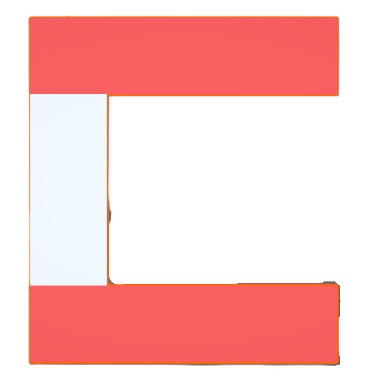
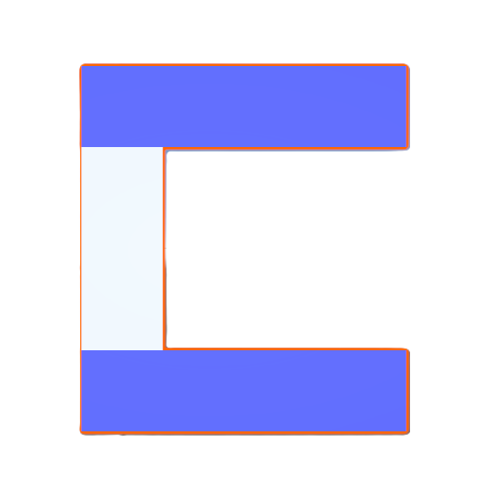

# Magnetic Robots Factoty

Unity와 Meta XR 기반으로 제작한 VR 로봇 분류 게임입니다. 플레이어는 컨베이어 벨트로 이동하는 빨강/파랑 로봇을 자기 장치로 조작해 같은 색상의 파이프에 분류합니다. 제한 시간 안에 정확하게 분류해 높은 점수를 획득하는 것이 목표입니다.

## 프로젝트 개요

- **장르**: VR 아케이드 / 작업 시뮬레이션
- **플랫폼**: Meta Quest 계열 XR 환경을 기준으로 제작
- **플레이 목표**: 90초 동안 로봇을 올바른 색상의 파이프로 보내기
- **핵심 플레이 감각**: 손으로 자기 장치를 잡고, 로봇의 색상을 판별하며, 컨베이어 속도를 조절하는 빠른 분류 플레이

## 핵심 기능

- 빨강/파랑 로봇의 무작위 생성
- 컨베이어 벨트 이동 및 속도 조절
- 왼손/오른손 자기 장치의 VR Hand Grab 인터랙션
- 색상별 파이프 판정
- 점수 및 제한 시간 UI
- 게임 종료 및 최종 점수 표시
- 현재 씬 재시작 기능
- Unity Input System 및 OpenXR 기반 입력 구성

## 게임 설명 및 점수 규칙

1. 게임이 시작되면 로봇이 컨베이어 벨트 위에 일정한 간격으로 생성됩니다.
2. 로봇을 자기 장치로 잡아 이동시킵니다.
3. 빨강 로봇은 빨강 파이프, 파랑 로봇은 파랑 파이프로 보냅니다.
4. 제한 시간은 90초이며, 시간이 끝나면 스포너가 멈추고 최종 점수가 표시됩니다.

| 상황 | 점수 |
| --- | ---: |
| 로봇을 올바른 색상의 파이프로 분류 | +10 |
| 로봇을 잘못된 색상의 파이프로 분류 | -5 |
| 로봇을 분류하지 못하고 폐기 구역으로 보냄 | -5 |

## 게임 조작

### VR 조작

- 왼손 컨트롤러 또는 손으로 왼쪽 자기 장치를 잡습니다.
- 오른손 컨트롤러 또는 손으로 오른쪽 자기 장치를 잡습니다.
- 자기 장치로 로봇을 끌어 해당 색상의 파이프에 넣습니다.
- UI의 속도 슬라이더를 조작해 컨베이어 벨트 속도를 변경합니다.

### 입력 구성

프로젝트에는 Unity Input System 액션 에셋이 포함되어 있으며 `Move`, `Look`, `Attack`, `Interact`, `Crouch`, `Jump`, `Previous`, `Next`, `Sprint` 액션이 정의되어 있습니다. VR 환경에서는 OpenXR 컨트롤러와 Meta XR Hand Grab 인터랙션을 중심으로 플레이합니다.

## 디렉터리 구조

```text
Assets/
├── Scenes/              # Tutorial, Main 등 게임 씬
├── Scripts/             # 게임 매니저, 스포너, 컨베이어, 점수 판정 스크립트
├── Prefab/              # 게임 오브젝트 및 인터랙션 프리팹
├── Images/              # 손/자기 장치 안내 이미지
├── Delivery Robot/      # 로봇 모델과 텍스처
├── EKstudio/            # 공장 기계 및 환경 에셋
├── FreeLowPolyRobot/    # 로우 폴리 로봇 에셋
├── HandRailGun/         # 자기 장치 관련 에셋
├── LowPolyWeapons/      # 무기 및 재질 에셋
├── MetaXR/              # Meta XR 관련 리소스
├── Oculus/              # Oculus 관련 리소스
├── XRI/                 # XR Interaction Toolkit 관련 리소스
├── XR/                  # XR 설정 및 리소스
├── Settings/            # 프로젝트 설정 리소스
├── Resources/           # 런타임 로드 리소스
└── InputSystem_Actions.inputactions  # 입력 액션 정의
Packages/
└── manifest.json        # Unity 패키지 의존성
ProjectSettings/
└── ProjectVersion.txt   # Unity Editor 버전
```

### 주요 스크립트

- `GameManager.cs`: 90초 타이머, 점수, 게임 시작/종료, 컨베이어 속도 제어
- `RobotSpawner.cs`: 빨강/파랑 로봇 무작위 생성
- `ConveyorBelt.cs`: 컨베이어 위 물체 이동 및 속도 변경
- `PipeZone.cs`: 로봇 색상과 파이프 색상 비교 및 점수 반영
- `DestroyZone.cs`: 분류되지 못한 로봇 제거 및 감점
- `ChangeManager.cs`: 왼손/오른손 자기 장치 Grab 상태와 시각 요소 전환
- `UIManager.cs`: 튜토리얼 진행과 `Main` 씬 전환

## 환경 설정

### 개발 환경

- **Unity**: `6000.2.8f1`
- **Render Pipeline**: Universal Render Pipeline `17.2.0`
- **XR**: OpenXR Plugin `1.15.1`, XR Plugin Management `4.5.3`
- **VR Interaction**: XR Interaction Toolkit `3.2.2`
- **Meta XR**: Meta XR SDK All `81.0.0`
- **Input**: Input System `1.14.2`
- **UI**: TextMesh Pro / Unity UI
- **언어**: C#

### 주요 Unity 패키지

| 패키지 | 버전 |
| --- | --- |
| Meta XR SDK All | 81.0.0 |
| XR Interaction Toolkit | 3.2.2 |
| OpenXR Plugin | 1.15.1 |
| XR Plugin Management | 4.5.3 |
| Input System | 1.14.2 |
| AI Navigation | 2.0.9 |
| Shader Graph | 17.2.0 |
| Timeline | 1.8.9 |
| Visual Scripting | 1.9.7 |

## 실행 방법

1. Unity Hub에서 Unity `6000.2.8f1`을 설치합니다.
2. Unity Hub의 **Add > Add project from disk**를 선택합니다.
3. 저장소의 프로젝트 루트 폴더를 선택합니다.
4. 프로젝트가 열리면 XR 기기 또는 OpenXR 런타임을 연결합니다.
5. `Assets/Scenes/Tutorial.unity`를 열고 Play를 눌러 튜토리얼을 확인합니다.
6. 튜토리얼 완료 후 `Assets/Scenes/Main.unity`에서 본 게임을 실행합니다.

### Build Settings

빌드에 포함된 씬은 다음과 같습니다.

- `Assets/Scenes/Tutorial.unity`
- `Assets/Scenes/Main.unity`

`SampleScene.unity`는 현재 Build Settings에서 비활성화되어 있습니다.

## 주요 에셋

- **Delivery Robot**: 색상별 배송 로봇 모델과 텍스처
- **EKstudio Low Poly Factory Machine Pack**: 공장 기계 및 제조 시설 환경
- **Free Low Poly Robot**: 로우 폴리 로봇 리소스
- **HandRailGun / LowPolyWeapons**: 손으로 사용하는 자기 장치 및 관련 모델
- **Meta XR / Oculus / XRI**: VR 손 추적, 컨트롤러, Grab 인터랙션 구성
- **TextMesh Pro**: 타이머, 점수, 속도 UI

## 예시 화면 및 조작 안내

현재 저장소에는 게임플레이 스크린샷 대신 손/자기 장치의 색상 안내 이미지가 포함되어 있습니다.

| 왼손 자기 장치 | 오른손 자기 장치 |
| --- | --- |
|  |  |

게임플레이 캡처를 추가하려면 이미지를 `Assets/Images/`에 넣은 뒤 아래와 같이 README에 연결할 수 있습니다.

```markdown

```

## 프로젝트 상태

현재 VR 기본 플레이 루프와 점수 시스템이 구현되어 있습니다. 실제 실행 시에는 Unity 버전과 XR 런타임을 맞추고, 사용하는 Meta Quest 기기에서 OpenXR 및 권한 설정을 확인해야 합니다.